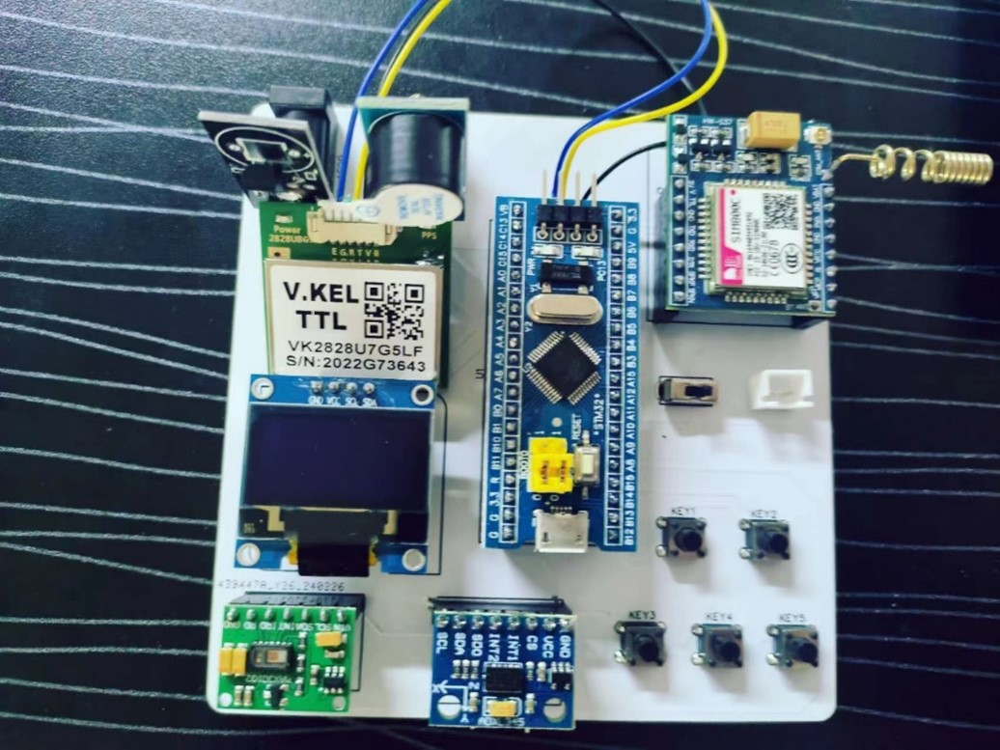
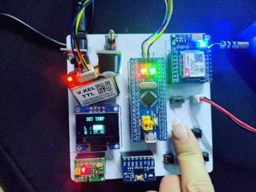
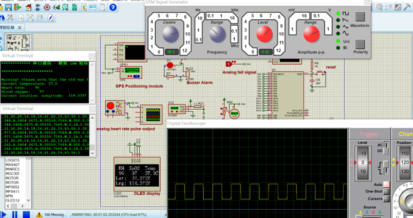
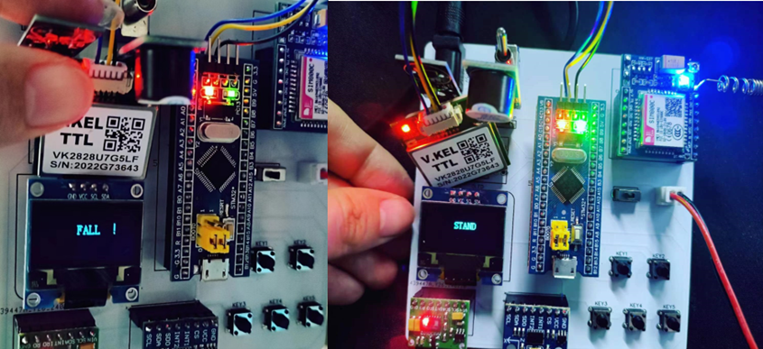
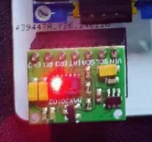
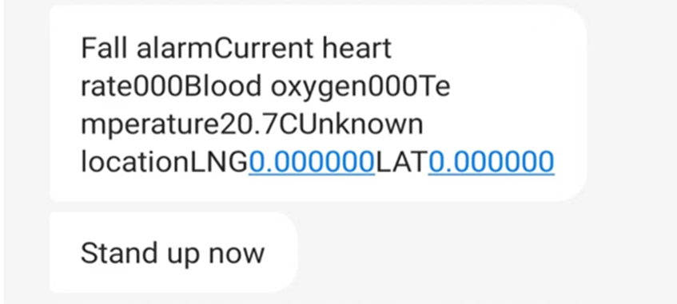

# STM32-Based Elderly Fall Detection and Health Monitoring System

## 📌 Project Overview

This project implements a **remote elderly health monitoring and fall detection system** based on the **STM32F103C8T6 microcontroller**.

The system integrates multiple sensors to monitor the physiological condition and motion status of elderly users in real time. When abnormal events occur, such as **falls or abnormal vital signs**, the device automatically triggers an alarm and sends an **SMS alert containing GPS location information**.

The goal of this project is to provide a **portable and low-cost safety monitoring solution for elderly care**.

---

## 📷 System Prototype

---

## ⚙️ System Features

- Fall detection using **ADXL345**
- Heart rate monitoring (**MAX30102**)
- Blood oxygen monitoring
- Body temperature monitoring (**DS18B20**)
- GPS positioning
- SMS alarm notification (**SIM800 GSM module**)
- OLED real-time display
- Health parameter threshold configuration
- Emergency help button

---

## 🧪 Experimental Results

### System Working State

---

### Proteus Simulation

---

### Fall Detection Experiment

The **ADXL345 accelerometer** is used to detect motion changes and determine whether a fall occurs.

---

### Heart Rate Sensor Test

The red LED indicates that the **MAX30102 sensor is actively detecting heart rate and blood oxygen signals**.

---

### SMS Alert Example

When abnormal conditions occur, the system sends an **SMS alert containing health data and location information**.

---

## 📍 GPS Positioning Test

.png)

### Important Note

- Indoor environments **cannot receive satellite signals**.
- Therefore **latitude and longitude cannot be displayed indoors**.
- In **open outdoor environments**, GPS coordinates can be obtained normally.

---

## 🎥 Demonstration Videos

### Hardware Demonstration

Click the link below to watch the hardware demonstration video:

[Hardware Demonstration Video](docs/video/Hardware_Demonstration_Video.mp4)

---

### System Simulation Demonstration

Click the link below to watch the simulation demonstration video:

[System Simulation Demonstration](docs/video/System_Simulation_Demonstration.mp4)

---

## 📂 Repository Structure
stm32-fall-detection-system
│
├── bom
│ └── list.xlsx
│
├── docs
│ ├── images
│ ├── video
│ └── U2180177 Li Fengzhe Final report.pdf
│
├── hardware
│ Reference hardware design files
│
├── src
│ STM32 firmware source code
│
└── README.md

---

## ⚠️ Hardware Files Notice

The **hardware folder** contains schematic and PCB design files created during development.

These files represent **design drafts and intermediate versions**, and may not correspond exactly to the final hardware implementation used in the experiments.

They are provided **for reference purposes only**.

---

## 📦 Bill of Materials

Component list:
bom/list.xlsx

---

## 📄 Project Report

Full project dissertation:
docs/U2180177 Li Fengzhe Final report.pdf

---

## 👨‍💻 Author

**Fengzhe Li**

Embedded Systems | STM32 | IoT
